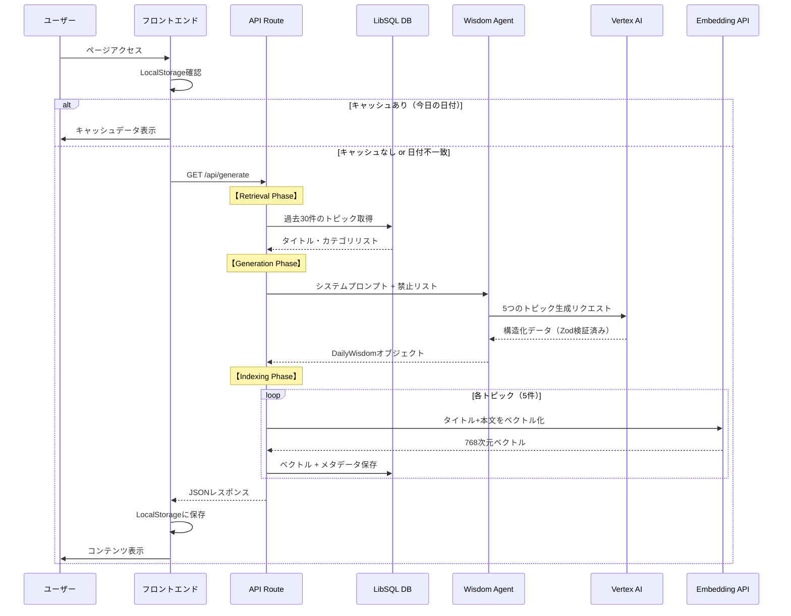
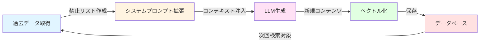
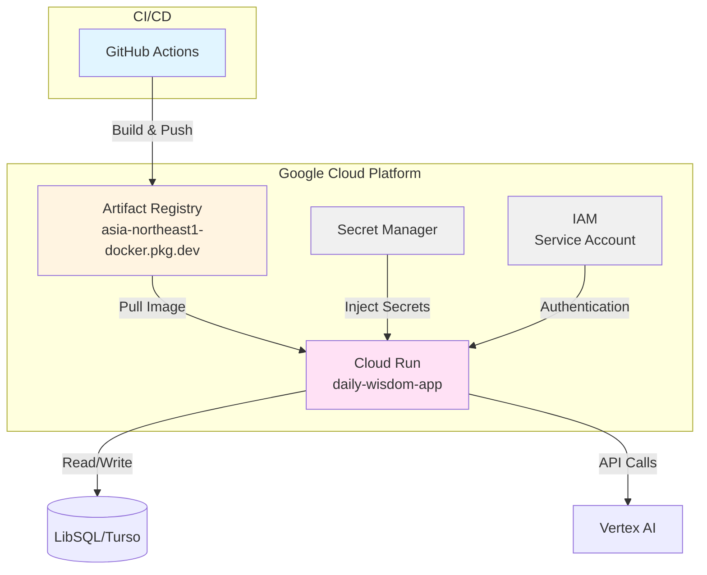

# Daily Wisdom アーキテクチャ概要

## 概要

Daily Wisdomは、ディズニーリゾートの知識を毎日5つ提供するWebアプリケーションです。RAG（Retrieval-Augmented Generation）パターンを採用し、過去の知識を参照しながら新しいコンテンツを生成します。

## システム構成

### 技術スタック

#### フロントエンド
- **Next.js 16** (App Router)
- **React 19**
- **TypeScript**
- **Tailwind CSS**

#### バックエンド
- **Next.js API Routes**
- **Mastra** (AIエージェント管理フレームワーク)

#### AI/LLM
- **Google Vertex AI** (Gemini 2.5 Flash)
- **Vercel AI SDK** (generateObject, embed)

#### データベース
- **LibSQL** (Turso)** - ベクトル検索対応SQLite
- ベクトル埋め込み保存による類似度検索

#### インフラストラクチャ
- **Google Cloud Run** - コンテナ実行環境
- **Google Artifact Registry** - コンテナイメージレジストリ
- **Google Secret Manager** - シークレット管理
- **Google Cloud IAM** - 認証・認可

## アーキテクチャ図

```mermaid
graph TB
    subgraph "Client (Browser)"
        UI[Next.js Frontend<br/>React 19 + TypeScript]
        LS[LocalStorage<br/>キャッシュ管理]
    end

    subgraph "Google Cloud Platform"
        subgraph "Cloud Run"
            API[Next.js API Route<br/>/api/generate]
            AGENT[Wisdom Agent<br/>Mastra Framework]
        end

        subgraph "AI Services"
            VERTEX[Vertex AI<br/>Gemini 2.5 Flash]
            EMBED[Vertex AI<br/>text-embedding-004]
        end

        subgraph "Data Layer"
            DB[(LibSQL/Turso<br/>ベクトルDB)]
        end

        subgraph "Infrastructure"
            AR[Artifact Registry<br/>Docker Images]
            SM[Secret Manager<br/>認証情報管理]
        end
    end

    UI -->|GET /api/generate| API
    UI -->|Read/Write| LS
    LS -->|Cache Check| UI

    API -->|Retrieval| DB
    API -->|Generation| AGENT
    AGENT -->|Generate Content| VERTEX
    API -->|Embedding| EMBED
    EMBED -->|Save Vectors| DB
    API -->|Return JSON| UI

    AR -->|Deploy| Cloud Run
    SM -->|Secrets| Cloud Run
    Cloud Run -->|Read| SM

    style UI fill:#e1f5ff
    style API fill:#fff4e1
    style AGENT fill:#ffe1f5
    style VERTEX fill:#e1ffe1
    style EMBED fill:#e1ffe1
    style DB fill:#ffe1e1
    style LS fill:#f0f0f0
```

## データフロー

### 1. コンテンツ生成フロー



### 2. RAG（Retrieval-Augmented Generation）パターン



## 主要コンポーネント

### 1. フロントエンド (`src/app/page.tsx`)

**責務:**
- ユーザーインターフェースの提供
- ローカルストレージによるキャッシュ管理
- ReadingモードとQuizモードの切り替え
- APIからのデータ取得と表示

**主要機能:**
- 日付ベースのキャッシュ判定
- プログレスバー表示
- クイズ採点機能

### 2. API Route (`src/app/api/generate/route.ts`)

**責務:**
- RAGパイプラインの実行
- データベースとの連携
- LLM呼び出しの調整

**処理フロー:**
1. **Retrieval**: 過去30件のトピックを取得し、禁止リストを作成
2. **Generation**: システムプロンプトに禁止リストを注入してLLM生成
3. **Indexing**: 生成結果をベクトル化してデータベースに保存

### 3. Wisdom Agent (`src/mastra/agents/wisdomAgent.ts`)

**責務:**
- AIエージェントの定義
- 出力スキーマの定義（Zod）
- モデル設定

**特徴:**
- ディズニーコンシェルジュとしてのペルソナ
- パーク体験に紐づく知識生成
- 6つのカテゴリから5つのトピックを生成

### 4. データベース (`src/lib/db.ts`)

**責務:**
- LibSQLクライアントの初期化
- ベクトルデータの保存・検索

**スキーマ（推測）:**
```sql
CREATE TABLE wisdom_items (
  id INTEGER PRIMARY KEY,
  date TEXT,
  category TEXT,
  title TEXT,
  content TEXT,
  quiz_json TEXT,
  embedding BLOB,  -- ベクトルデータ
  created_at TIMESTAMP
);
```

## インフラストラクチャ

### デプロイメント構成



### 環境変数・シークレット

**Secret Managerで管理:**
- `AWS_ACCESS_KEY_ID` (将来のBedrock移行用)
- `AWS_SECRET_ACCESS_KEY`
- `AWS_REGION`
- `DATABASE_URL`
- `DATABASE_AUTH_TOKEN`

**環境変数:**
- `GOOGLE_VERTEX_PROJECT`
- `GOOGLE_VERTEX_LOCATION`

### リソース設定

- **メモリ**: 512Mi
- **CPU**: 1
- **タイムアウト**: 300秒
- **ポート**: 8080
- **公開設定**: 全ユーザーアクセス可能

## データモデル

### DailyWisdom Schema (Zod)

```typescript
{
  date: string,  // YYYY-MM-DD形式
  items: [
    {
      category: 'Park Secret' | 'Movie Trivia' | 'Attraction' | 
                'Food & Merch' | 'History' | 'Character',
      title: string,
      content: string,  // 約300文字の解説
      quiz: {
        question: string,
        options: [string, string, string, string],
        correctAnswer: string,
        explanation: string
      }
    }
  ]  // 必ず5つのトピック
}
```

## セキュリティ

1. **認証情報管理**: Google Secret Managerで管理
2. **IAM**: サービスアカウントによる最小権限の原則
3. **ネットワーク**: Cloud Runのデフォルトセキュリティ設定
4. **データ**: ベクトルデータはBlob形式で保存

## パフォーマンス最適化

1. **ローカルキャッシュ**: ブラウザのLocalStorageで1日分のデータをキャッシュ
2. **並列処理**: 5つのトピックのベクトル化を`Promise.all`で並列実行
3. **Standaloneビルド**: Next.jsのStandaloneモードで軽量なコンテナイメージ
4. **ベクトル検索**: 将来の類似トピック検索に備えたインデックス

## 今後の拡張可能性

1. **ベクトル検索**: 類似トピックの検索機能
2. **ユーザー履歴**: 個人の学習履歴管理
3. **カスタマイズ**: ユーザー好みに基づくトピック生成
4. **マルチモーダル**: 画像や動画の組み込み
5. **Amazon Bedrock**: 現在はVertex AIを使用しているが、Bedrockへの移行も可能

## 依存関係

### 主要パッケージ

- `next`: ^16.0.10
- `react`: 19.2.0
- `@mastra/core`: 0.24.9
- `@ai-sdk/google-vertex`: 2.1.22
- `ai`: 4.0.12
- `zod`: ^3.25.76
- `@libsql/client`: (LibSQLクライアント)

## 参考資料

- [Next.js Documentation](https://nextjs.org/docs)
- [Mastra Framework](https://mastra.ai)
- [Vercel AI SDK](https://sdk.vercel.ai)
- [LibSQL Documentation](https://libsql.org)
- [Google Cloud Run](https://cloud.google.com/run)

